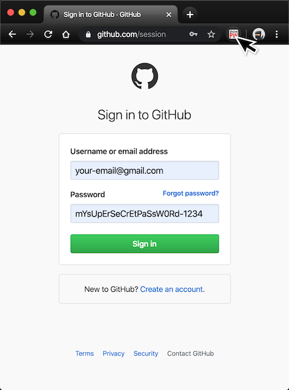

# ShowPassword: a small Google Chrome extension
A chrome extension that shows and hides passwords on a page

# Why?
In times like these, people often have dozens of accounts, each with a username and password. Then password managers can do a good job, but what if you want to know which password you chose and are too lazy to go inside the chambers of your password manager? The password is often already filled in in the password field like [•••••••••••••], but you cannot copy it from there. This little extension will instantly show and hide the password upon clicking the extension's button in the top right corner of your Chrome.

# How to install?
This extension is not hosted on the Chrome Web Store. Therefore, to make use of this extension you need to add it to Chrome yourself. But, this is not hard!

1. Download the zip of this project and unzip or use ```git clone``` to get a local copy of this extension.
2. Go to [chrome://extensions](chrome://extensions).
3. Click on Load Unpacked in the top left corner of the browser.
4. Select the folder that contains the files of this project.
5. Done!

# How to use
To use it, just click on the icon in the top right corner of Chrome when you are on a login page with the password like [•••••••••••••] to show it. Click the icon again to hide the password.



